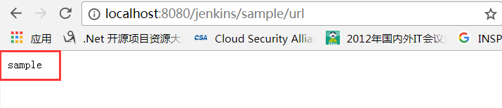
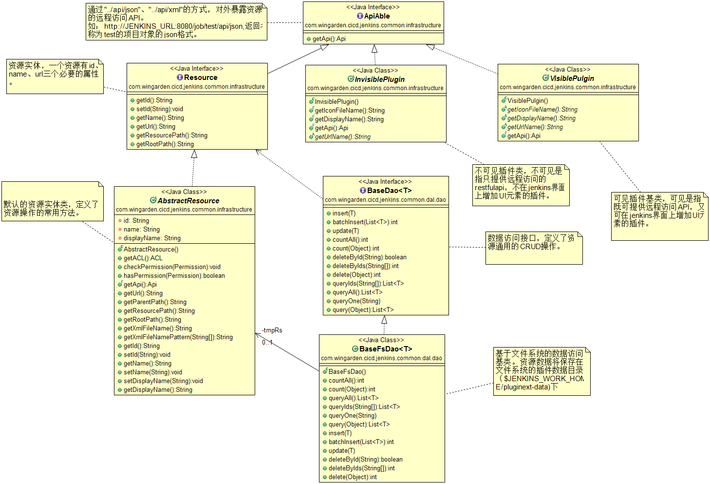
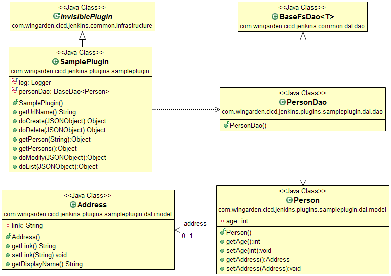

# Jenkins-Extend
Jenkins-Extend is a small framework base on Jenkins.It aims to rapid jenkins-plugin development.

---------

## 目录
* [概述](#概述)
* [编绎](#编绎)
    * [环境准备](#环境准备)
    * [编绎工程](#编绎工程)
* [开发指南](#开发指南)
    * [工程目录说明](#工程目录说明)
    * [插件开发步骤](#插件开发步骤)

## 概述
---
Wingrow需要获取及展示大规模数量的项目的构建与统计数据（包括job、project、build、过程日志等信息)。根据单一职责的原则，由jenkins统一处理构建资源，通过jenkins插件查询与统计需要的构建资源数据并对外暴露类restful的查询与统计接口。本项目提供该类Jenkins插件的基础开发架构。

## 编绎
---
### 环境准备
* 本工程的编绎，要求以下先决条件
  * 已安装jdk1.7及以上版本。
  * 可以访问sonatype nexus环境http://192.168.101.93:8081
  * 已安装maven3.x,且maven settings.xml文件增加以下内容
    
    ```java
    <pluginGroups>
      <pluginGroup>org.jenkins-ci.tools</pluginGroup>
    </pluginGroups>

    <servers>
      <server>
        <id>thirdparty</id>
        <username>deployment</username>
        <password>admin</password>
      </server>
    </servers>

    <mirrors>
      <mirror>
        <id>nexus</id>
        <mirrorOf>*</mirrorOf>
        <name>wingarden repository.</name>
        <url>http://192.168.101.93:8081/repository/public/</url>
      </mirror>
    </mirrors>
    ```
可查看[`m2.settings.xml`](http://10.0.2.50:180/wingrow/nexus-deployer/blob/master/buildtools-config/src/main/resources/maven/m2.settings.xml),该文件提供了maven settings文件的模板配置。

### 编绎工程

  
    mkdir wokspace
    git clone http:/10.0.2.50:180/wingrow/jenkins-extend.git  ##下载源代码
    cd jenkins-extend/sampleplugin                            ##进入工程目录
    mvn clean install hpi:run                                 ##启动插件环境
    访问http://localhost:8080/jenkins                         ##访问插件环境
    浏览器输入http://localhost:8080/jenkins/sample/url         ##验证插件运行，页面应显示如下



## 开发指南
---
### 工程目录说明
* 本工程目录结构如下：

    ```java
    - jenkins-extend                        ##父工程，pom.xml中定义插件开发所需的配置
      - jenkns-extend-common                ##插件通用工程
        - com.wingarden.cicd.jenkins.common ##
          - config                          ##通用配置
          - dal                             ##数据访问层包
            - dao                           ##数据访问类
            - model                         ##资源实体
          - infrastructure                  ##插件基础类
          - utils                           ##通用工具类
      - sampleplugin                        ##插件例子工程
    ```

### 基础实体说明


### 插件开发步骤
* 样例插件类图


1. 定义插件类，该类继承InvisiblePlugin
2. 定义插件url，该url为插件类的根访问路径。如下SamplePlugin的根访问路径为http://JNEKINS_URL:8080/sample

  ```java
  @Override
  @WebMethod(name = "url")
  @Exported(name = "url")
  public String getUrlName() {
    return "sample";
  }
  ```
* 参考[`SamplePlugin`](sampleplugin/src/main/java/com/wingarden/cicd/jenkins/plugins/sampleplugin/SamplePlugin.java)，定义远程访问方法。关于方法与URL的绑定，详见[`URL绑定指南`](http://stapler.kohsuke.org/reference.html)

* 测试：参考[`SamplePluginTest`](sampleplugin/src/test/java/com/wingarden/cicd/jenkins/plugins/sampleplugin/SamplePluginTest.java)

### 其它配置